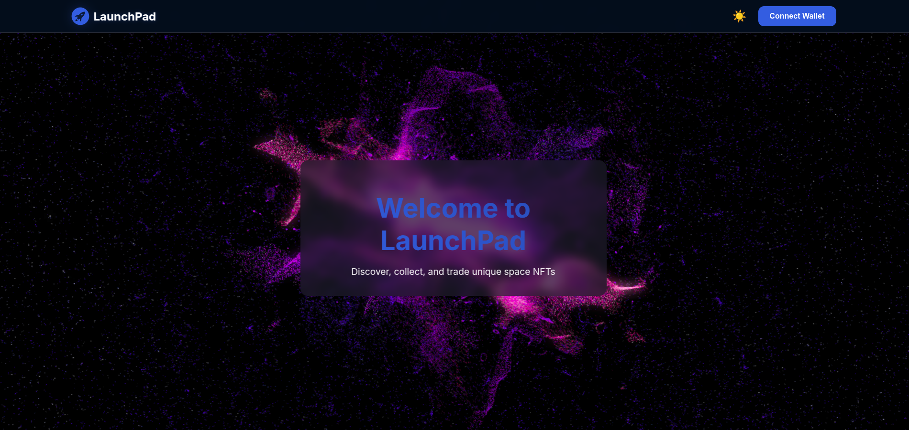
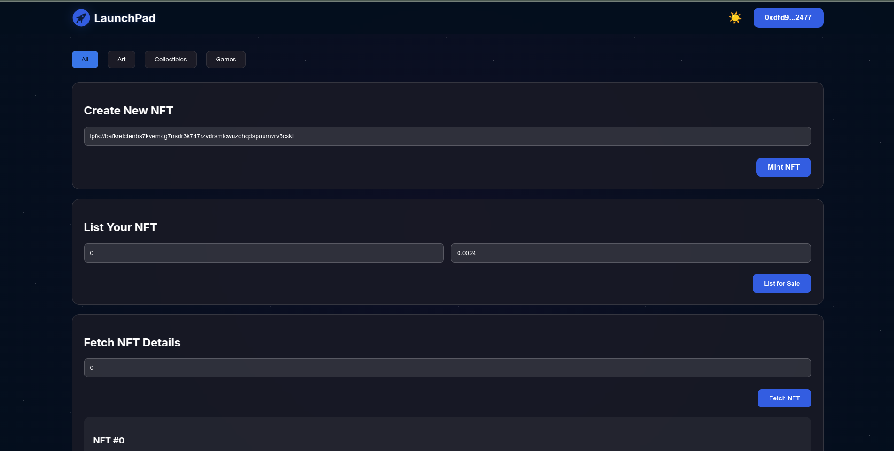
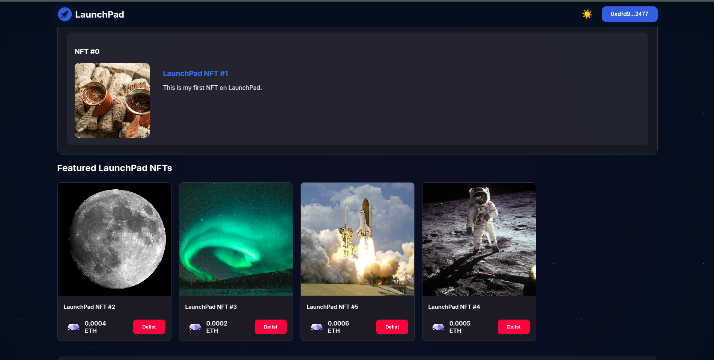
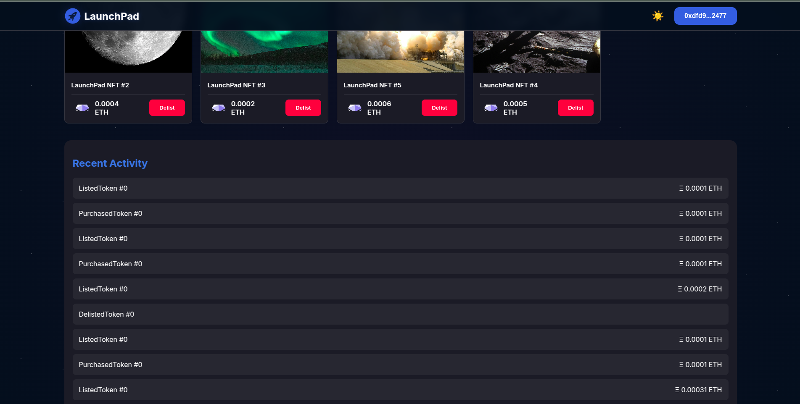

# 🚀 LaunchPad NFT Marketplace

LaunchPad NFT Marketplace is a decentralized platform where users can **mint**, **list**, **buy**, and **sell** NFTs on the Ethereum blockchain. Built using **Solidity, Hardhat, React, Ethers.js, and IPFS**, this project offers a seamless and intuitive experience for NFT enthusiasts.

---

## 🌟 Features
- 🖼 **Mint NFTs**: Upload NFT metadata to IPFS and mint unique NFTs.
- 📢 **List NFTs for Sale**: Set a price and list your NFTs on the marketplace.
- 💰 **Buy NFTs**: Purchase NFTs directly from the marketplace.
- ❌ **Delist NFTs**: Remove your NFT from the marketplace anytime.
- 📜 **Transaction History**: View all past transactions.
- 🔗 **Ethereum Integration**: Supports MetaMask for seamless transactions.
- ⚡ **Fast & Secure**: Uses Hardhat for smart contract development and Ethers.js for blockchain interaction.

---

## 🛠 Tech Stack

**Frontend:** React, JavaScript, Ethers.js, CSS

**Backend:** Solidity (Smart Contracts), Hardhat, IPFS

**Blockchain:** Ethereum (Sepolia Testnet)

---

## 🚀 Installation & Setup

### Prerequisites
Ensure you have the following installed:
- **Node.js** (v16 or later)
- **MetaMask** extension
- **Hardhat** (Ethereum development environment)

### 1️⃣ Clone the Repository
```bash
git clone https://github.com/sudhansu-24/launchpad.git
cd launchpad
```

### 2️⃣ Install Dependencies
```bash
npm install
```

### 3️⃣ Setup Environment Variables
Create a **.env** file in the root directory and add your **Infura/Alchemy API Key** and **MetaMask Private Key**:
```bash
PRIVATE_KEY=your-metamask-private-key
INFURA_API_KEY=your-infura-or-alchemy-api-key
```

### 4️⃣ Compile & Deploy Smart Contract
```bash
npx hardhat compile
npx hardhat run scripts/deploy.js --network sepolia
```
📌 **Note:** Save the deployed contract address and update it in `web3.js`.

### 5️⃣ Start the Frontend
```bash
cd frontend
npm install
npm start
```
The application will run at **http://localhost:3000**.

---

## 📜 Smart Contract Overview

### **LaunchPadNFT.sol** (Solidity Contract)
This contract handles the NFT minting, listing, buying, and delisting functionalities.
- **mintNFT(string memory tokenURI)** → Mints a new NFT
- **listNFT(uint256 tokenId, uint256 price)** → Lists an NFT for sale
- **buyNFT(uint256 tokenId)** → Buys an NFT
- **delistNFT(uint256 tokenId)** → Removes an NFT from sale

---

## 🎨 UI Screenshots






---

## 🤝 Contribution
Want to contribute? Follow these steps:
1. **Fork** the repository
2. **Clone** your forked repo
3. Create a new branch: `git checkout -b feature-branch`
4. Commit changes: `git commit -m "Your message"`
5. Push to GitHub: `git push origin feature-branch`
6. Open a **Pull Request**

---

## 📜 License
This project is licensed under the **MIT License**.

---

## 🌟 Acknowledgments
- OpenZeppelin for ERC721 contracts
- Hardhat for Solidity development
- MetaMask for Web3 integration
- IPFS for NFT metadata storage


